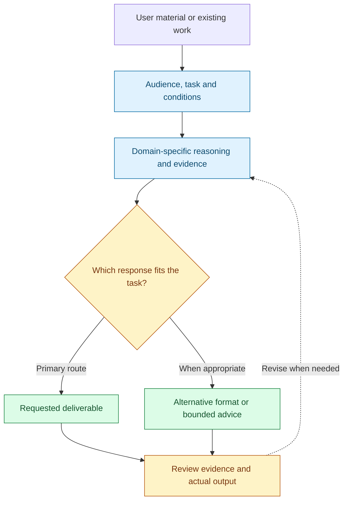
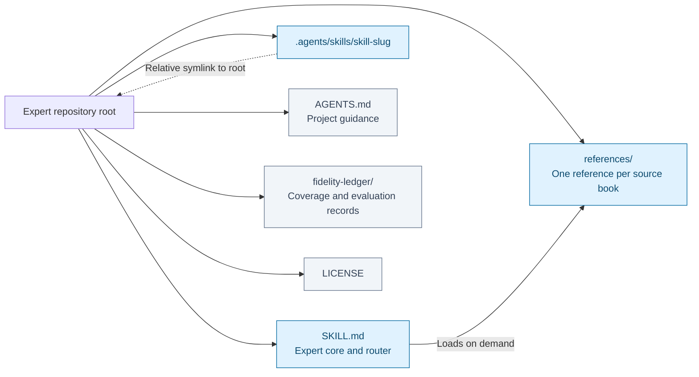
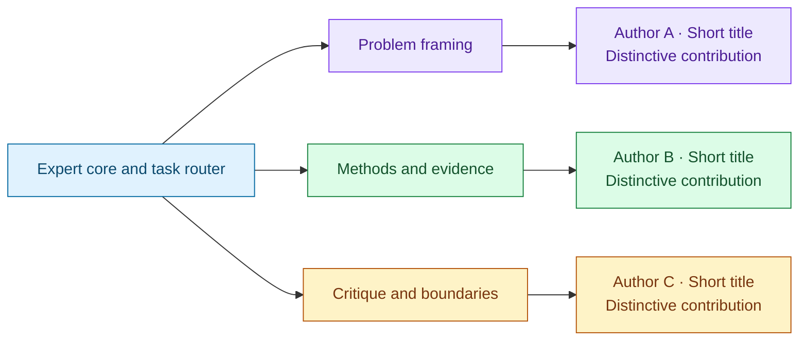

# Expert README template

Use this template when creating a generated expert's README or revising it during fold-in or documentation maintenance. It captures the user-approved structure of [Presentation Architect](https://github.com/ariel-lee-1023/presentation-architect/blob/352427c/README.md). Reuse its order and diagram roles, not its presentation-specific claims, source count, book titles or wording. Explicit user instructions and an existing destination's required documentation take precedence; preserve useful destination content when reorganizing it.

## Content order

| Position | Section | Content and presentation |
|---|---|---|
| 1 | `# <Expert name>` and introduction | Put the expert's first-person introduction immediately below the repository title, fully visible. No tagline, badge, navigation, diagram or intervening heading goes before it. Never put it in `
`. |
| 2 | Short orientation and navigation | After the introduction, add a concise reasoning-chain tagline, an optional scope sentence, and links to the main sections. Order navigation links to match the sections they target. |
| 3 | `## How it works` | Mermaid workflow: inputs, framing question, reasoning, meaningful decisions, deliverables and review. Follow with a short prose explanation. |
| 4 | `## Use it for` | Concrete user tasks and situations, including alternative outputs where appropriate. |
| 5 | `## Installation` | Real clone URL, directory and skill slug; canonical core and references; discovery or host installation instructions; invocation, tool dependencies and actual default language. |
| 6 | `## Example requests` | Representative prompts demonstrating creation, critique, difficult judgments and scope boundaries, adapted to the expert. |
| 7 | `## Repository layout` | Mermaid file/loading map plus ordinary relative Markdown links. This section precedes the source map. |
| 8 | `## Sources and their responsibilities` | Mermaid map from the expert/router through task responsibilities to supplied sources. Keep full author, title, edition and responsibility details in a table. This table may use `
`; attribution caveats and meaningful source disagreements remain visible. |
| 9 | `## Coverage and validation` | Actual inspected coverage, compression and extraction limits, links to maintainer records, and the real evaluation status. Distinguish editorial/structural checks from behavioral acceptance. |
| 10 | `## Limits` | Domain boundaries, source limitations and host verification requirements. |
| 11 | `## License` | Link the license and explain the scope of original work and exclusions for source books and other third-party material. Preserve existing terms. |

For a README in another requested language, translate the headings and update anchors while preserving these roles and order. Source counts, runtime paths, installation commands and validation claims must match the destination; the example's ten books and root layout are not universal facts.

## The opening stays visible

Follow [the expert introduction writing standard](../SKILL.md#writing-the-experts-readme-introduction). A useful three-paragraph shape is:

1. **How I approach the work:** the expert's governing question, distinctive reasoning and priorities.
2. **How my judgment changes with the situation:** one concrete domain example, alternatives considered and conditions that change the recommendation.
3. **What I can deliver and what I preserve:** concrete outputs, evidence standards, uncertainty and important boundaries.

The paragraph count can adapt to the expert. For layout-only edits, preserve the existing introduction verbatim unless the user requests a rewrite. Keep all its paragraphs together directly under the title. The rest of the README uses ordinary documentation prose.

## Three Mermaid connection diagrams

Use fenced `mermaid` blocks so the Markdown remains editable and GitHub can render the diagrams. The following are adaptable scaffolds, not a fixed runtime architecture or mandatory reasoning sequence. Replace generic labels with the destination's actual concepts and files; remove unsupported branches.

### 1. How it works: workflow

Prefer `flowchart TD` for the workflow. Arrows express an actual reasoning or production dependency; a decision diamond marks a real conditional choice. Include a review loop only where the expert actually revises its work.

Explain the workflow in prose below the diagram, including what the host must supply. Do not imply that reasoning instructions alone can generate, render or verify artifacts without appropriate tools.

### 2. Repository layout: files and loading

Prefer `flowchart LR` for a repository map. Label loading and discovery edges so they are distinguishable from directory membership. This scaffold represents the published-repository profile; adapt it to an existing destination's actual structure. Only draw files and aliases that exist.

Follow the map with relative Markdown links to the actual core, references and maintainer records. A label inside a diagram is not a replacement for a navigable file link. Do not route runtime questions into the fidelity ledger.

### 3. Sources and responsibilities: source map

Prefer `flowchart LR`: expert/router → task responsibility → author and short title, with a short contribution label. Group by what each source helps decide, rather than presenting a reading sequence. Scale the number of groups and source nodes to the actual corpus. Shared responsibilities may have multiple connections; avoid implying that authors agree merely because they share a branch.

Keep a full source table beneath this map with columns for author/title, supplied edition and responsibility. Link to actual reference files and distinguish source-specific claims, cross-source synthesis and unresolved disagreements. Never substitute diagram abbreviations for full attribution.

## Layout and review

- Keep diagrams outside collapsed blocks. Use short quoted node labels, meaningful edge labels and `accTitle`/`accDescr` descriptions. Use ` ` for deliberate line breaks, and keep normal prose summaries or linked tables available alongside the diagrams.
- The example colors distinguish roles or source groups; labels and connections must carry the meaning without color. Use high-contrast text and borders, and avoid one crowded graph for the whole README.
- Render the final diagrams with a compatible Mermaid renderer and inspect wrapping, clipping, overlapping edges and legibility at README width. Check the target GitHub view when available. If rendering cannot be checked, report that limitation instead of claiming visual validation.
- Confirm the introduction is visible immediately under the title, the section order matches the table, and Repository layout precedes Sources and their responsibilities. Check Markdown links, heading anchors, discovery paths, source counts and preserved edition details.
- Preserve substantive content during layout-only changes, including limitations and unrun evaluation status. Collapsing a detailed bibliography is optional; collapsing the self-introduction is not part of this template. Mermaid rendering checks do not establish behavioral acceptance of the expert.
